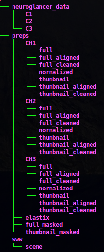

# Utilities for the Active Atlas Pipeline
## Creating a sandbox on your computer
1. git clone this reposititory `git clone git@github.com:eddyod/pipeline_utility.git`
1. create a virtual environment in your home dir: python3 -m venv ~/.virtualenvs/pipeline3
1. cd pipeline_utility
1. source ~/.virtualenvs/pipeline3/bin/activate
1. pip install -r requirements.txt
1. We are currently using Ubuntu 18.04 as of October 2020. Either install this on your local machine or install it
as a VM with Virtualbox or VMware
1. Create this directory to start with: `sudo mkdir -p /net/birdstore/Active_Atlas_Data/data_root/pipeline_data/DK52/preps/CH1` 
1. Make yourself user: `sudo chown -R myloginname: /net`
1. Set up ssh keys on ratto with ssh-copy-id
1. Get some thumbnails to start with 
`rsync -auv ratto.dk.ucsd.edu:/net/birdstore/Active_Atlas_Data/data_root/pipeline_data/DK52/preps/CH1/thumbnails/ 
/net/birdstore/Active_Atlas_Data/data_root/pipeline_data/DK52/preps/CH1/thumbnails/`
1. You can now experiment with some of the thumbnails for DK52
### Setup the database portal on your local machine
1. Get repo: `git clone git@github.com:eddyod/ActiveBrainAtlasAdmin.git`
1. create a virtual environment in your home dir: python3 -m venv ~/.virtualenvs/activebrainatlas
1. cd activebrainatlas
1. source ~/.virtualenvs/activebrainatlas/bin/activate
1. pip install -r requirements.txt

### For Neuroglancer scripts,
1. git clone https://github.com/HumanBrainProject/neuroglancer-scripts.git
2. python3 -m venv ~/.virtualenvs/neuroglancer
3. source ~/.virtualenvs/neuroglancer/bin/activate
4. cd neuroglancer-scripts
5. python setup.py install
6. Look in ~/.virtualenvs/neuroglancer/bin/ for the precomputed scripts
### Directory structure of the pipeline
1. The base directory is located on birdstore at: /net/birdstore/Active_Atlas_Data/data_root/pipeline_data
2. All brains are located in the base directory.
3. To view the post tif pipeline process go here: [Neuroglancer process](PROCESS.md)
4. The directory structure of a 3 channel brain will look like this:

### Annotations
1. Annotation keys are viewable: [here](https://activebrainatlas.ucsd.edu/annotation-keys.html)
### Database backups
1. The development and production databases are backed up multiple times each day on basalis
1. If you need a backup, look on basalis at: /home/eodonnell/sql/backups
1. The development database is named active_atlas_development
1. The production database is named active_atlas_production
